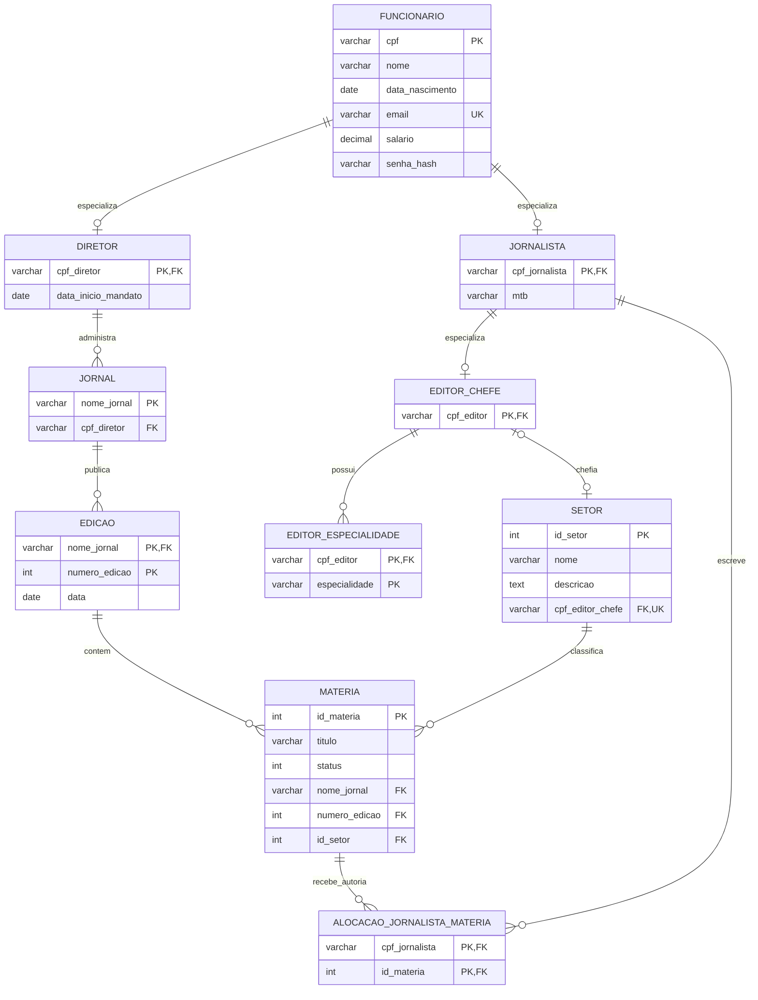

# Editora BD

Projeto Banco de Dados — CRUD de gestão editorial, com login de funcionário e tela de
Relatórios como página inicial.

## Integrantes
* **Joran Vinicius Silveira Lage**
* **Matheus Windson Libório Araújo**
* **Felipe dos Santos Ferreira**
* **Leonardo Sabino Pereira**
  
## Stack

- FastAPI + Jinja2 (templates renderizados no servidor)
- PostgreSQL 15, acessado via **psycopg 3** puro (SQL cru + pool de conexões) — **sem ORM**, ou seja, sem SQLAlchemy nem Django ORM. Todo o acesso a dados fica nas classes `*Repository` em `app/repositories/`.
- Migrações SQL simples (`migrations/*.sql`), aplicadas automaticamente no início da aplicação
- Bootstrap 5 (via CDN) + design tokens próprios em `app/static/css/app.css` (cores, raio de borda, sombra) reaproveitados em toda a aplicação — sem framework de componentes adicional
- [Chart.js](https://www.chartjs.org/) (via CDN, só na tela de Relatórios) para os gráficos do dashboard

## Portas

| Serviço | Porta | Observação |
|---|---|---|
| Banco (Postgres 15) | `5432` | Container `db`, usuário `root`, senha `root`, banco `root`. |
| Backend (FastAPI) | `8000` | Container `web`. |
| Frontend | `8000` (mesma do backend) | Não existe um serviço de frontend separado: as telas (HTML) são renderizadas no próprio servidor pelo FastAPI via Jinja2, então o frontend é servido na **mesma porta** do backend. |

## Correções da versão anterior

Problemas identificados na entrega anterior e corrigidos diretamente na `main`
(commits `c14a703`, `25121f9` e `67d1e2e`):

- **Hierarquia de especialização de `Editor_Chefe` incorreta**: `Editor_Chefe` era
  modelado como subtipo disjunto de `Funcionario`, o que impedia um editor-chefe de
  assinar matérias como jornalista (já que `alocacao_jornalista_materia` referencia
  `jornalista.cpf_jornalista`). Corrigido especializando `Editor_Chefe` a partir de
  `Jornalista` — ver seção [Esquema Conceitual](#esquema-conceitual).
- **Semântica de `materia.status` divergente**: o Dicionário de Dados definia
  `0 = Reprovada, 1 = Aprovada, 2 = Em Andamento`, mas o seed e o frontend usavam uma
  ordem diferente. Corrigido para que seed, backend e frontend usem o mapeamento
  documentado.
- **CHECK constraints ausentes no DDL**: não havia validação de banco para salário
  negativo, datas futuras (`data_nascimento`, `data_inicio_mandato`) e domínio de
  `materia.status`. Todas as três foram adicionadas em `migrations/0001_create_tables.sql`.
- **Build do Docker quebrado**: o `Dockerfile` copiava e exigia `uv.lock`
  (`uv sync --frozen`), mas o arquivo estava no `.gitignore` e nunca era versionado; a
  imagem base também era `python:3.11-slim`, incompatível com o
  `requires-python >= 3.12` do `pyproject.toml`. Corrigido versionando o `uv.lock` e
  atualizando a imagem base para `python:3.12-slim`.

## Rodando o projeto

Pré-requisito: Docker e Docker Compose instalados.

```bash
docker compose up -d --build
```

Isso sobe dois serviços definidos no `docker-compose.yml` — `db` e `web`, já
configurados com a `DATABASE_URL` do `db` diretamente no `docker-compose.yml` (sem
precisar de `.env`) — ver as portas de cada um na seção [Portas](#portas).

Ao iniciar, a aplicação já roda as migrações pendentes automaticamente contra o `db`.

Acesse em http://localhost:8000.
Para teste usar email: "teste@editorabd.com" e senha: "senha123"

Para derrubar os containers:

```bash
docker compose down
```

Para apagar também os dados do banco (recomeça do zero):

```bash
docker compose down -v
```

## Login

A aplicação exige login de funcionário para acessar qualquer página — tentar abrir
`http://localhost:8000/` (ou qualquer rota interna) sem estar autenticado redireciona
automaticamente para `http://localhost:8000/login`.

Qualquer **URL sem rota correspondente** (endereço digitado errado) também redireciona:
para `/login` se não houver sessão, ou para `/relatorios` se o usuário estiver logado
— nunca mostra a página de erro 404 padrão. É uma rota catch-all registrada por último
em `app/main.py`, então só pega o que nenhum router tratou; um recurso inexistente numa
rota real (ex.: `/funcionarios/<cpf que não existe>`) continua respondendo `404`.

**Autenticação:** e-mail + senha do funcionário. A senha é validada no backend contra
um hash salgado (PBKDF2-HMAC-SHA256, `app/security.py`) guardado na nova coluna
`funcionario.senha_hash` — nunca em texto puro. A sessão é mantida por um cookie
assinado (`SessionMiddleware` do Starlette, chave configurável via a variável de
ambiente `SESSION_SECRET`); "Sair" no cabeçalho encerra a sessão.

**Usuário de teste** (criado automaticamente pela migration
`0004_add_login_funcionario.sql`, disponível logo após `docker compose up`, sem
nenhum passo manual):

```text
E-mail: teste@editorabd.com
Senha:  senha123
```

Após o login, o usuário é direcionado direto para a tela de **Relatórios**, que passa
a ser a página inicial do sistema. As demais áreas (Funcionários, Jornais, Edições,
Setores, Matérias) continuam acessíveis pelo menu no cabeçalho.

## Povoamento do banco

O povoamento é feito **via script DML (`INSERT`)**. Não
existe um passo manual separado para popular o banco: schema (DDL) e dados (DML) são
tratados como o mesmo mecanismo de migração.

- `migrations/0001_create_tables.sql` — DDL: cria as 10 tabelas do esquema lógico
  (`funcionario`, `diretor`, `jornalista`, `editor_chefe`, `editor_especialidade`,
  `jornal`, `edicao`, `setor`, `materia`, `alocacao_jornalista_materia`), com PKs, FKs
  e constraints.
- `migrations/0002_database_seed.sql` — DML: popula as 10 tabelas, respeitando a ordem
  de dependência das chaves estrangeiras (`funcionario` → subtipos → `jornal` →
  `edicao`/`setor` → `materia` → `alocacao_jornalista_materia`), com no mínimo 50
  tuplas nas tabelas principais (ex.: `funcionario`, `edicao`, `materia`) e 15 nas
  secundárias (ex.: `diretor`, `jornalista`, `editor_chefe`, `jornal`, `setor`,
  `editor_especialidade`, `alocacao_jornalista_materia`).
- `migrations/0003_create_views.sql` — DDL: cria 5 das 6 Views SQL usadas na tela de
  Relatórios (ver seção [Views SQL e Relatórios](#views-sql-e-relatórios)).
- `migrations/0004_add_login_funcionario.sql` — DDL + DML: adiciona a coluna
  `funcionario.senha_hash` e cria o funcionário de teste usado no login (ver seção
  [Login](#login)).
- `migrations/0005_trigger_historico_status_materia.sql` — DDL: cria a tabela de
  auditoria `historico_status_materia` e a trigger `trg_historico_status_materia` (ver
  seção [Trigger](#trigger)).
- `migrations/0006_view_historico_status_materia.sql` — DDL: cria a 6ª View,
  `vw_historico_status_materia`, que traduz os códigos de status da tabela de auditoria
  para texto e junta o título da matéria (usada no relatório de histórico de status).
- `migrations/0007_seed_historico_status_materia.sql` — DML: exercita a trigger
  `trg_historico_status_materia` fazendo cada uma de 12 matérias percorrer os outros
  dois status e **voltar ao status original** (o estado final do seed não muda). Assim o
  relatório de histórico de status já vem populado logo após o `docker compose up`, sem
  depender de o usuário aprovar/reprovar algo antes.

Esses arquivos ficam em `migrations/*.sql` e são aplicados **automaticamente, em
ordem, toda vez que a aplicação sobe** — ver `app/db/migrate.py`, chamado no `lifespan`
de `app/main.py`. Cada arquivo já aplicado é registrado numa única tabela de controle,
`schema_migrations` (criada pelo próprio `migrate.py` se não existir), guardando o nome
do arquivo e o timestamp de quando rodou. Antes de aplicar cada `.sql`, o runner checa
se o nome já está nessa tabela; se estiver, pula — então subir a aplicação de novo
(`docker compose up -d --build`) nunca reaplica nem duplica o que já rodou.

Ou seja: basta iniciar a app que o schema e os dados já ficam em dia, sem comando
manual de migração.

Para adicionar uma nova migração (schema ou dados), crie um arquivo novo em
`migrations/` seguindo o padrão de numeração (`0008_algo.sql`) — ele será aplicado no
próximo start da app.

## Views SQL e Relatórios

`migrations/0003_create_views.sql` cria 5 Views que unem dados de 3+ tabelas para
simplificar as consultas usadas nos relatórios; `migrations/0006_view_historico_status_materia.sql`
acrescenta uma 6ª, sobre a tabela de auditoria alimentada pela [Trigger](#trigger):

| View | Tabelas envolvidas | Finalidade |
|---|---|---|
| `vw_resumo_edicoes_jornal` | `jornal`, `diretor`, `funcionario`, `edicao` | Total de edições e data da última edição de cada jornal, com o nome do diretor responsável. |
| `vw_carga_materias_jornalista` | `jornalista`, `funcionario`, `alocacao_jornalista_materia`, `materia` | Quantidade de matérias por jornalista, já separadas por status (aprovadas/reprovadas/em andamento). |
| `vw_setores_editores` | `setor`, `editor_chefe`, `funcionario`, `editor_especialidade` | Cada setor com o nome do editor-chefe responsável e suas especialidades agregadas. |
| `vw_funcionarios_detalhes` | `funcionario`, `diretor`, `jornalista`, `editor_chefe` | Todos os funcionários com o cargo (Diretor/Jornalista/Editor-Chefe) resolvido dinamicamente a partir da herança. |
| `vw_materias_completas` | `materia`, `setor`, `edicao`, `alocacao_jornalista_materia`, `jornalista`, `funcionario` | Catálogo de matérias com setor, edição/jornal, status por extenso e os autores agregados. |
| `vw_historico_status_materia` | `historico_status_materia`, `materia` | Histórico de mudanças de status de cada matéria (título + status anterior/novo por extenso + timestamp), a partir da tabela de auditoria da trigger. |

Essas Views são consultadas por `app/repositories/relatorios.py` e exibidas na tela
`GET /relatorios` (`app/routers/relatorios.py` + `app/templates/relatorios/list.html`),
que é a **página inicial** do sistema após o login (também acessível a qualquer
momento pelo link "Relatorios", primeiro item do menu no cabeçalho).

### Dashboard

A tela é um dashboard, não uma lista de tabelas empilhadas:

- **4 indicadores** no topo (Jornais, Edições, Jornalistas, Matérias) — somas/contagens
  calculadas a partir dos próprios dados das Views, sem consulta extra.
- **6 gráficos** (biblioteca [Chart.js](https://www.chartjs.org/), via CDN — a única
  adicionada; nenhuma dependência Python nova), um para cada View:
  - *Edições por jornal* — ranking em barras horizontais (`vw_resumo_edicoes_jornal`);
    o tooltip de cada barra mostra o diretor e a data da última edição.
  - *Carga de matérias por jornalista* — ranking em barras horizontais **empilhadas**
    por status (aprovadas/em andamento/reprovadas), usando as colunas já agregadas de
    `vw_carga_materias_jornalista` — sem recalcular nada no frontend.

  Os dois rankings mostram só o **Top 10** no gráfico (com mais categorias o gráfico
  fica ilegível) — a tabela logo abaixo continua com a lista completa.
  - *Especialidades dos editores-chefe* — barras horizontais com quantos setores cada
    especialidade cobre, derivado do campo `especialidades` (agregado) de
    `vw_setores_editores`.
  - *Funcionários por cargo* — gráfico de rosca com a composição
    Diretor/Jornalista/Editor-Chefe/sem cargo, a partir de `vw_funcionarios_detalhes`.
  - *Catálogo completo de matérias* — gráfico da distribuição por status, a partir de
    `vw_materias_completas` (a View mais extensa, cuja listagem completa fica na tabela
    ao lado).
  - *Histórico de status de matéria* — distribuição das transições de status
    registradas pela trigger, a partir de `vw_historico_status_materia`.
- Cada gráfico é acompanhado de uma **tabela complementar** com os valores exatos e de
  botões **Exportar CSV** / **Exportar PDF** (ver seção
  [Exportação de relatórios](#exportação-de-relatórios)).
- Cores dos gráficos reaproveitam as mesmas variáveis CSS (`--cor-primaria`,
  `--cor-sucesso`, `--cor-aviso`, `--cor-perigo`, ...) já usadas nos badges de status do
  resto da aplicação, lidas em tempo de execução via `getComputedStyle`.

O layout usa um grid responsivo (`.relatorios-grid` em `app/static/css/app.css`): os
seis relatórios ficam em três linhas de pares lado a lado (uma coluna só em telas
menores). Cada card tem sua própria área de rolagem vertical (com cabeçalho de tabela fixo) para
não esticar a página, além do scroll horizontal já existente por tabela. Cada seção
trata individualmente os estados de carregando (spinner no botão "Atualizar"), erro
(mensagem amigável, sem stack trace) e sem dados — uma falha ou ausência de dados numa
View não derruba as demais.

### Exportação de relatórios

Cada um dos 6 relatórios pode ser baixado em dois formatos, pelos botões no cabeçalho
do card:

| Formato | Rota | Detalhes |
|---|---|---|
| CSV | `GET /relatorios/{nome_relatorio}/csv` | Separador `;` e BOM UTF-8, para abrir direto no Excel; datas em `dd/mm/aaaa` e valores monetários formatados. |
| PDF | `GET /relatorios/{nome}/pdf` | Gerado com `fpdf2` (única dependência Python nova), tabela em paisagem com cabeçalho por coluna. |

Os `nome`s válidos são as chaves das Views: `resumo_edicoes_jornal`,
`carga_materias_jornalista`, `setores_editores`, `funcionarios_detalhes`,
`materias_completas` e `historico_status_materia`. Um nome desconhecido responde `404`.
Ambas as rotas usam a mesma consulta da tela, então o arquivo exportado bate linha a
linha com a View correspondente.

## Esquema Conceitual



Importante: `Editor_Chefe` especializa `Jornalista` (não `Funcionario` diretamente) —
todo editor-chefe é, por definição, um jornalista, o que permite que ele apareça em
`alocacao_jornalista_materia` como autor. Ver `migrations/0001_create_tables.sql`,
constraint `fk_editor_chefe_jornalista`.

> O arquivo `Diagrama Lógico UML.pdf`, na raiz do repositório, foi produzido na entrega
> anterior e ainda descreve `Editor_Chefe` como especialização direta de `Funcionario` —
> ficou desatualizado após a correção acima. O diagrama Mermaid desta seção reflete o
> schema atual (`migrations/0001_create_tables.sql`) e deve ser tratado como a fonte da
> verdade.

## Dicionário de Dados

O dicionário de dados completo está no arquivo
**[`Dicionário de Dados.pdf`](./Dicionário%20de%20Dados.pdf)**, na raiz do repositório.
Ele cobre:

- as **11 tabelas** do domínio (`funcionario` e os subtipos `diretor` / `jornalista` /
  `editor_chefe`, `editor_especialidade`, `jornal`, `edicao`, `setor`, `materia`,
  `alocacao_jornalista_materia` e `historico_status_materia`) — atributos, tipos,
  PKs/FKs e CHECK constraints;
- as **6 Views** de relatório (`vw_resumo_edicoes_jornal`, `vw_carga_materias_jornalista`,
  `vw_setores_editores`, `vw_funcionarios_detalhes`, `vw_materias_completas`,
  `vw_historico_status_materia`) — colunas, tipos e semântica;
- a tabela de controle de migrações `schema_migrations`.

A visão geral de entidades e relacionamentos está no diagrama da seção
[Esquema Conceitual](#esquema-conceitual).

## Trigger

`migrations/0005_trigger_historico_status_materia.sql` cria a única trigger do banco,
com foco em **auditoria**: registrar toda mudança de status de uma matéria, sem
depender de nenhuma lógica no backend — funciona mesmo que o `UPDATE` seja feito
direto no banco, fora da aplicação.

| | |
|---|---|
| Nome | `trg_historico_status_materia` |
| Dispara em | `AFTER UPDATE OF status ON materia`, `FOR EACH ROW` |
| Função associada | `fn_registrar_historico_status_materia()` |
| Tabela de auditoria | `historico_status_materia` (`id_materia`, `status_anterior`, `status_novo`, `alterado_em`) |

**Regra de negócio:** sempre que `materia.status` muda de valor (comparação
`OLD.status IS DISTINCT FROM NEW.status`, para não gravar nada em updates que não
afetam o status), a trigger insere uma linha em `historico_status_materia` com o
status anterior, o novo status e o timestamp da alteração. Isso existe para dar
rastreabilidade ao fluxo editorial (quem aprovou/reprovou o quê e quando fica
registrado de forma imutável, independente de quem ou o quê alterou a matéria),
sem exigir nenhuma alteração no código da aplicação para ser mantido.

### Como testar

**Via UI** — aprovando/reprovando uma matéria:

1. Acesse `/materias`, abra uma matéria existente e clique em "Editar".
2. Troque o campo "Status" (ex.: de "Em Andamento" para "Aprovada" ou "Reprovada") e
   salve.
3. Confirme que a trigger disparou consultando a tabela de auditoria (via SQL, abaixo)
   — deve existir uma linha nova para aquele `id_materia`.

**Via SQL direto** — sem passar pela aplicação:

```bash
docker compose exec db psql -U root -d root
```

```sql
-- estado antes: o historico ja vem populado pelo seed (migration 0007), entao a
-- materia 1 costuma ter algumas linhas aqui — anote a contagem atual
SELECT * FROM historico_status_materia WHERE id_materia = 1 ORDER BY alterado_em DESC;
SELECT status FROM materia WHERE id_materia = 1;  -- status atual

-- dispara a trigger com um UPDATE direto no banco (use um valor DIFERENTE do
-- status atual mostrado acima; 0 = Reprovada, 1 = Aprovada, 2 = Em Andamento)
UPDATE materia SET status = 1 WHERE id_materia = 1;

-- confirma que uma nova linha foi registrada automaticamente
SELECT * FROM historico_status_materia WHERE id_materia = 1 ORDER BY alterado_em DESC;
```

Rodar o mesmo `UPDATE` de novo com o mesmo valor de `status` (sem mudança real) não
gera uma nova linha — a trigger só registra transições efetivas de status.

## Testes

Testes de integração ponta a ponta (`tests/test_smoke.py`, com `pytest` + o
`TestClient` do FastAPI) cobrem: login com credenciais válidas/inválidas, bloqueio de
acesso sem autenticação, logout (e bloqueio de acesso após ele), carregamento das
páginas principais, CRUD completo de uma entidade, o dashboard de Relatórios exibindo
as Views (gráficos + tabelas), que os números embutidos nos gráficos batem com uma
consulta direta às Views, e o tratamento de erro para uma referência inválida (FK). Não
usam mocks — rodam contra um Postgres de verdade.

Pré-requisito: o banco acessível (`docker compose up -d db`, ou a stack completa).

```bash
uv run pytest
```

## Estrutura

```
app/
  main.py
  config.py
  templating.py
  routers/
  services/
  repositories/
  schemas/
  exceptions/
  db/
  templates/
  static/
migrations/
```

| Caminho | Responsabilidade |
|---|---|
| `app/main.py` | Ponto de entrada: cria a FastAPI, roda as migrações no startup (`lifespan`), registra o `SessionMiddleware`, os routers e os exception handlers globais |
| `app/config.py` | Leitura de variáveis de ambiente (ex.: `DATABASE_URL`, `SESSION_SECRET`) via pydantic-settings |
| `app/templating.py` | Configuração do Jinja2 (motor de templates) |
| `app/security.py` | Hash e verificação de senha (PBKDF2-HMAC-SHA256) usados no login |
| `app/routers/` | Rotas HTTP — recebem a requisição, chamam o service e devolvem a resposta (JSON ou HTML). Ex.: `app/routers/funcionarios.py` |
| `app/services/` | Regra de negócio: validações (ex.: CPF duplicado) e orquestração entre repositories, sem falar SQL diretamente |
| `app/repositories/` | Acesso ao banco: todo o SQL cru (psycopg) fica aqui, uma classe `*Repository` por entidade |
| `app/schemas/` | Modelos Pydantic usados como contrato de entrada/saída da API e para popular os templates |
| `app/exceptions/` | Exceções de domínio (ex.: `FuncionarioNaoEncontradoError`), traduzidas em respostas HTTP pelos routers |
| `app/db/` | Pool de conexão (`pool.py`), dependency do FastAPI para obter uma conexão por requisição (`dependencies.py`) e o runner de migrações (`migrate.py`) |
| `app/templates/` | Páginas Jinja2 (HTML), uma pasta por entidade |
| `app/static/` | Arquivos estáticos (CSS/JS) servidos em `/static` |
| `migrations/` | Scripts SQL (DDL + DML), aplicados em ordem no startup da app |
